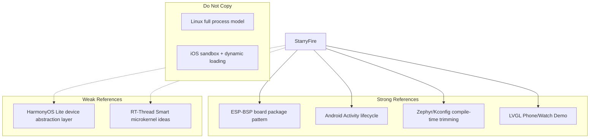
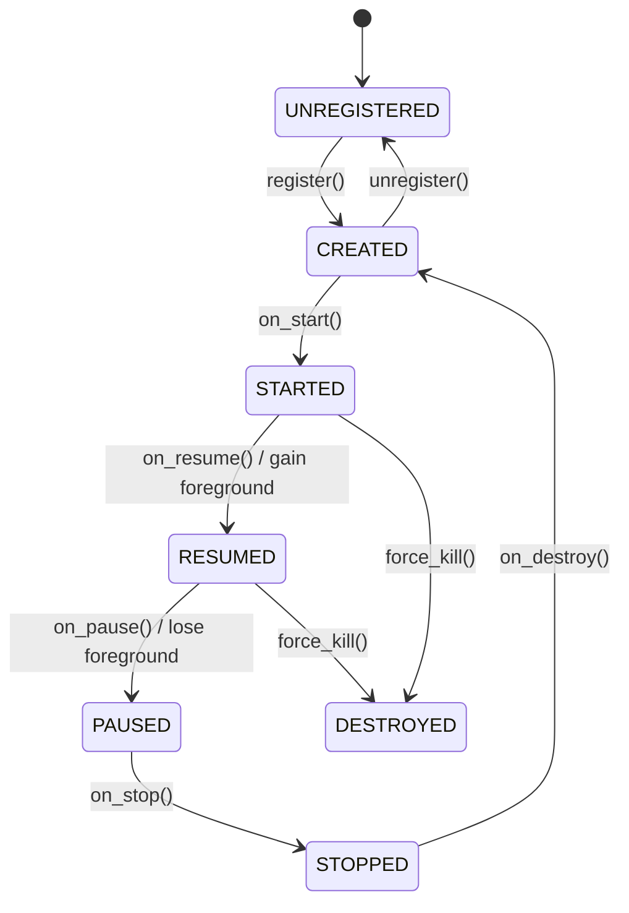
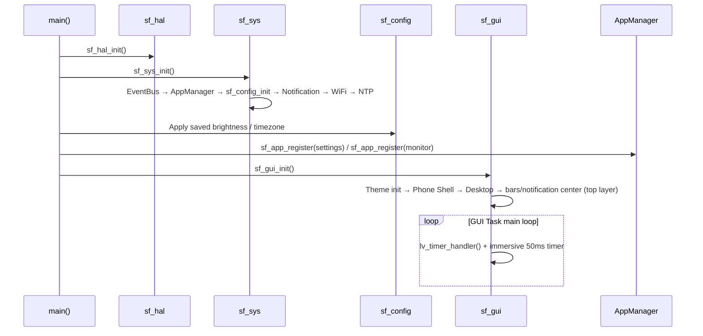

# StarryFire Design Document

> Status: **P0–P3 implemented** (sf_hal / sf_sys / sf_gui / two built-in apps all functional, build passes); P4 cross-board validation in progress.
> Sections marked **【Implemented】** reflect current state; the rest are plans. Refer to code for actual implementation.

---

## 1. Project Overview

### 1.1 Vision

StarryFire is a **lightweight graphical operating system framework** for the ESP32 family — not a replacement for FreeRTOS, but a layer on top of ESP-IDF providing:

- Unified **board abstraction** with **compile-time trimming**
- Desktop/phone-like **app model** (icons, lifecycle, Launcher, Intent)
- Standard GUI runtime based on **LVGL**
- Extensible **third-party / custom app** development approach

### 1.2 Non-Goals (v1)

| Non-Goal | Reason |
|----------|--------|
| Full POSIX compatibility | Limited ESP32 resources, low ROI |
| Multi-process + MMU isolation | Most ESP32s lack MMU, high cost |
| Dynamic `.so` linking | Heavy Flash/RAM overhead, weak toolchain support |
| Replacing ESP-IDF | Reuse IDF drivers, networking, NVS, etc. |
| v1 dark theme / user-customizable theme | ThemeEngine has reserved interfaces; Settings does not expose them yet |

### 1.3 Target Use Cases

- Dev boards / small-screen production devices (240×240 ~ 480×480, including round watch faces)
- IoT panels with touchscreens, portable instruments, educational kits
- Same OS framework — swap boards by changing Kconfig / board profile, no business logic rewrite

---

## 2. Locked Design Decisions

| # | Topic | **Decision** | Status |
|---|-------|-------------|--------|
| 1 | OS vs FreeRTOS | **Single GUI Task** runs LVGL and App lifecycle callbacks; only WiFi/sensor heavy logic runs in separate background Tasks, which must not call LVGL directly | ✅ Implemented |
| 2 | Board config format | **Pure Kconfig + `boards/<name>/sdkconfig.defaults`**, no YAML toolchain | ✅ Implemented |
| 3 | Target chip scope | **v1 ESP32-S3 only**; HAL interfaces预留 for C3/C6 after P4 | ✅ (HAL abstracted) |
| 4 | App loading | **v1 static linking**, `sf_app_register()` explicit registration; SPIFFS dynamic package deferred | ✅ Implemented (static) |
| 5 | Inter-app navigation | **Intent model** (action / extras / intent-filter resolution) | ✅ Implemented |
| 6 | Back / Home keys | **Bottom soft nav bar** (Back / Home) + left-edge swipe-back gesture; board Kconfig maps physical buttons | ✅ Implemented (soft keys + gesture) |
| 7 | Background app policy | Max **2 PAUSED** apps, **LRU eviction**; system apps with `SF_APP_FLAG_PINNED` exempt | ✅ Implemented (`CONFIG_SF_SYS_MAX_PAUSED_APPS`) |
| 8 | UI style | **Compile-time choice**: `CONFIG_SF_GUI_SHELL_PHONE` (rectangular) or `CONFIG_SF_GUI_SHELL_WATCH` (round) | 🟡 Phone implemented, Watch not |
| 9 | Immersive mode | Edge gesture reveals bars; **5s idle auto-hide**; notification center pulled from top | ✅ Implemented |
| 10 | Theme | **Runtime switching** (default dark NEBULA + light CRYSTAL), persisted in config | ✅ Implemented |
| 11 | Legacy LCD driver | Migrated to `sf_hal/display/backends/st7789`, conditional compilation | ✅ Implemented |
| 12 | API naming | Unified **`sf_` prefix** (StarryFire) | ✅ Implemented |
| 13 | Docs & comments | **All Chinese** (design docs, code comments, public API docs) | ✅ Implemented |
| 14 | IDF version | **v5.4.3** (follows IDF LTS strategy, evaluate break changes on upgrade) | ✅ |
| 15 | Partition table | **Custom OTA dual-partition** (3MB + 3MB) + **SPIFFS ~10MB** see §7.4 | ✅ Implemented |
| 16 | Logging | **Reuse ESP_LOG**, debug via `idf.py monitor`; each layer uses its own TAG | ✅ Implemented |
| 17 | Font strategy | v1 enables built-in Montserrat subsets (12/14/16/20/28/48); **on-demand SPIFFS font loading deferred** | ✅ (built-in fonts) |
| 18 | Testing strategy | P0–P4 no mandatory unit tests; PC simulation framework deferred | ✅ Adopted |

---

## 3. Market Reference Analysis

We select references from two dimensions: "worth borrowing" and "should avoid":



| Reference | What We Borrow | What We Don't |
|-----------|---------------|---------------|
| **Android** | Activity lifecycle, Manifest metadata, Launcher, Intent | Binder, Zygote, ART, permission framework complexity |
| **watchOS / Wear OS** | Single-screen multi-app, background restrictions, watch face as system app | Cloud sync, complex notification system |
| **HarmonyOS Lite** | HAL, device-driver-service layering | Distributed soft bus |
| **Zephyr RTOS** | Kconfig driver trimming, Devicetree board description | Full Zephyr kernel |
| **NuttX / RT-Thread Smart** | User-space app vs kernel separation ideas | Separate address spaces (not applicable to ESP32) |
| **Espressif ESP-BSP** | One-board-one-package, `bsp_*` unified API | No app framework |
| **LVGL Phone Demo** | Desktop, status bar, app switching UI paradigm | No lifecycle management |

**Core conclusion**: StarryFire = **ESP-IDF foundation** + **Kconfig compile-time trimming** + **Android-style lifecycle + Intent** + **ESP-BSP-style board package**.

---

## 4. Design Principles

1. **Compile-time determined, runtime lightweight** — Peripherals, shell form, drivers, apps all selected at compile time.
2. **Layered unidirectional dependency (compile-time include)** — Include direction is APP → GUI → System → Driver; reverse includes prohibited. Runtime allows GUI↔System **callback collaboration**: AppManager holds GUI-injected window interface (`sf_gui_window_ops_t`), calls back into GUI at lifecycle points; GUI calls `sf_app_start` / `sf_app_pause_current`. Both run within the single GUI Task — this is dependency inversion, not a dependency cycle (see §5.2).
3. **Board-chip decoupling** — SoC capabilities and board wiring configured separately (`boards/<name>/` component).
4. **Apps as first-class citizens** — System apps and third-party apps share the same API and lifecycle.
5. **Single-threaded GUI** — All LVGL operations execute only in the GUI Task context (esp_lvgl_port lock).
6. **Progressive complexity** — v1 static apps; dynamic loading introduced on demand.

---

## 5. Overall Architecture

```
┌─────────────────────────────────────────────────────────────┐
│                        APP Layer                             │
│  Manifest + intent-filter + sf_app_ops lifecycle callbacks  │
│  (settings / monitor)                                        │
├─────────────────────────┼───────────────────────────────────┤
│                      GUI Layer (GUI Task)                    │
│  Phone Shell │ Launcher │ Theme │ Bars │ Notification Center │
├─────────────────────────┼───────────────────────────────────┤
│                     System Layer                             │
│  AppManager │ IntentResolver │ EventBus │ Notification      │
│  WiFi │ NTP │ Config(SPIFFS)                                 │
├─────────────────────────┼───────────────────────────────────┤
│                     HAL Layer (sf_hal)                       │
│  display(ST7789) │ input(CST328) │ board │ core             │
├─────────────────────────┼───────────────────────────────────┤
│                   ESP-IDF + FreeRTOS                         │

  Background Tasks (optional): WiFi connection, SNTP sync … → notify via EventBus, never touch LVGL
```

### 5.1 Task Model

```mermaid
graph LR
    subgraph GUI_Task["GUI Task (sole LVGL thread)"]
        LVGL[lv_timer_handler]
        AM[AppManager lifecycle dispatch]
        WM[Phone Shell (UI hooks / desktop / bars)]
        CB[Current app on_* callbacks]
    end
    subgraph BG_Tasks["Optional Background Tasks"]
        WIFI[WiFi Service]
        SNTP[Time Service]
    end
    BG_Tasks -->|EventBus| AM
    AM --> CB
    CB --> WM
    WM --> LVGL
```

| Rule | Description |
|------|-------------|
| LVGL thread safety | Only GUI Task may call `lv_*` / `sf_gui_*` |
| App lifecycle | `on_create` … `on_destroy` called synchronously in GUI Task |
| App heavy work | Run in separate Task; notify via `sf_event_publish()`; App updates UI in `on_event` |
| Stack size | GUI Task stack ≥ 8 KB (includes LVGL + deepest App call chain) |

### 5.2 Inter-Layer Communication Rules

| Direction | Allowed | Mechanism |
|-----------|---------|-----------|
| APP → GUI | ✅ | `sf_gui_*` |
| APP → System | ✅ | `sf_sys_*` (events, storage, networking, etc.) |
| APP → Driver | ❌ | Must go through System or HAL services |
| GUI → System | ✅ | Window focus, input dispatch |
| GUI ↔ System (runtime callback) | ✅ | System calls back into GUI via injected `sf_gui_window_ops_t` (ui_root create/destroy/show/hide); GUI calls `sf_app_start` / `sf_app_pause_current`. Both occur within GUI Task, no lock contention |
| System → Driver | ✅ | HAL abstraction |
| Driver → Upper layers | ❌ | Only via callbacks / events |

---

## 6. Detailed Design per Layer

### 6.1 HAL Layer (sf_hal)

**Responsibility**: Shield board differences, provide unified HAL API upward.

#### 6.1.1 Module Division 【Implemented】

```
components/sf_hal/
├── include/                # sf_hal.h (module interfaces, sf_board_pins_t, sf_display_config_t)
├── core/                   # sf_hal_core.c — sf_hal_init() / deinit()
├── board/                  # sf_hal_board.c — pin table (collected from board Kconfig)
├── display/
│   ├── sf_hal_display.c    # Display driver abstraction (#if CONFIG_SF_HAL_DISPLAY_* conditional)
│   └── backends/
│       └── st7789/         # ST7789 driver (migrated from legacy components/lcd)
└── input/
    ├── sf_hal_input.c      # Touch driver abstraction
    └── cst328/             # CST328 I2C touch driver
```

#### 6.1.2 Board Configuration 【Implemented】

**No YAML**. Each board is a component directory, registered via root `CMakeLists.txt`'s `EXTRA_COMPONENT_DIRS apps boards`:

```
boards/
└── esp32s3-touch-lcd-2_8/
    ├── CMakeLists.txt      # Empty component registration (idf_component_register())
    ├── Kconfig.projbuild   # Board select + pins (SF_PIN_*) + bus ports + driver select
    ├── sdkconfig.defaults  # Board-level hardware config (display/touch/PSRAM/Flash/partition table)
    └── partitions.csv      # Board-specific partition table
```

**Board selection mechanism** (root `CMakeLists.txt`):

1. If environment variable `SF_BOARD=<name>` exists → use that board;
2. Otherwise auto-detect `boards/`: if only one directory, use it automatically; if multiple, error and require `SF_BOARD`;
3. When `SDKCONFIG_DEFAULTS` is not explicitly set, merge "root generic + `boards/<board-name>/` board-level" defaults ( latter overrides former).

**Multi-board conflict prevention**: `EXTRA_COMPONENT_DIRS boards` registers all board components under boards/ (all Kconfigs merged); root `CMakeLists.txt` uses `EXTRA_COMPONENT_EXCLUDE_DIRS` to exclude unselected board directories (set after `include(project.cmake)` but before `project()`), ensuring only the selected board's Kconfig participates in trimming.

```
boards/esp32s3-touch-lcd-2_8/sdkconfig.defaults:   # Board-level differences only (OS generic items in root defaults)
CONFIG_SF_BOARD_ESP32S3_TOUCH_LCD_2_8=y
CONFIG_SF_HAL_DISPLAY_ST7789=y
CONFIG_SF_HAL_DISPLAY_WIDTH=240
CONFIG_SF_HAL_DISPLAY_HEIGHT=320
CONFIG_SF_HAL_INPUT_TOUCH_CST328=y
CONFIG_SPIRAM=y
CONFIG_ESPTOOLPY_FLASHSIZE_16MB=y
CONFIG_PARTITION_TABLE_CUSTOM_FILENAME="boards/esp32s3-touch-lcd-2_8/partitions.csv"
```

Pin definitions and bus port/channel numbers are exposed as hidden symbols (`CONFIG_SF_PIN_*`, `CONFIG_SF_HAL_LCD_SPI_HOST`, etc.) via the board `Kconfig.projbuild`, collected by `sf_hal/board/sf_hal_board.c` into `sf_board_pins_t`. Display panel visible parameters are overridden via `sdkconfig.defaults` from `sf_hal/Kconfig` defaults.

#### 6.1.3 Chip Scope

- v1 code and CI guarantee **ESP32-S3** compilation only
- SoC capabilities in `sf_hal/core/Kconfig` guarded by `depends on IDF_TARGET_ESP32S3`
- C3/C6 porting requires re-evaluation of PSRAM / frame buffer strategy

#### 6.1.4 HAL API Style 【Implemented】

Drivers are selected at compile time via `#if CONFIG_SF_HAL_*` (see board Kconfig / sdkconfig.defaults). Initialization uses **explicit configuration API** with **no runtime module table**: a parameterless `init(void)` cannot accommodate display/input configuration parameters (`sf_display_config_t` / `cst328_config_t`), and there is a mandatory initialization order (`board → display → input`). If runtime detection / hot-plug is needed later, introduce it with actual signatures.

```c
esp_err_t sf_hal_init(void);                              /* Unified entry (board → display → input) */
const sf_board_pins_t *sf_hal_board_get_pins(void);       /* Board pin table */
esp_err_t sf_hal_display_init(const sf_display_config_t *cfg);
esp_err_t sf_hal_display_set_brightness(uint8_t percent); /* Backlight PWM */
```

---

### 6.2 System Layer (sf_sys)

**Responsibility**: Core OS services, mediator between Apps and HAL.

#### 6.2.1 Core Subsystems 【Implemented】

| Subsystem | Responsibility | Implementation |
|-----------|---------------|----------------|
| **AppManager** | Registry, lifecycle, foreground/background, LRU eviction | ✅ `sf_app_manager.c` |
| **IntentResolver** | Match action/category, resolve target app and extras | ✅ `sf_intent_resolver.c` |
| **EventBus** | System events (esp_event bridge + custom events) | ✅ `sf_event_bus.c` |
| **Notification** | Notification center data source (post / dismiss / unread count) | ✅ `sf_notification.c` |
| **WiFi** | STA connection, scanning, credential management (background Task) | ✅ `sf_wifi.c` |
| **NTP** | SNTP time sync + timezone | ✅ `sf_ntp.c` |
| **Config (sf_config)** | SPIFFS JSON persistence (brightness/timezone/theme/WiFi credentials) | ✅ Separate component `sf_config` |
| PowerManager | Backlight, sleep, freeze PAUSED app timers | ❌ Not implemented (backlight brightness available) |
| StorageService | App-private NVS namespace | ❌ Not implemented |

#### 6.2.2 App Lifecycle 【Implemented】

Based on Android Activity, simplified to an ESP32-implementable subset:



| State | Meaning | App Should |
|-------|---------|------------|
| CREATED | Instance allocated, UI not shown | Initialize resources |
| STARTED | Visible but may lack focus | Stop animations, etc. |
| RESUMED | Foreground active | Refresh UI, handle input |
| PAUSED | Covered by another app | Pause heavy operations |
| STOPPED | Not visible | Release non-essential resources |
| DESTROYED | About to be unloaded | Clean up all resources |

**Key constraints (v1)**:
- Only **1 RESUMED app** at a time
- Max **2 PAUSED apps** in background (`CONFIG_SF_SYS_MAX_PAUSED_APPS`)
- Excess triggers LRU eviction → STOPPED → DESTROYED
- Lifecycle nodes drive `ui_root` creation/show/hide via **UI hooks** registered by the GUI layer (`sf_app_manager_set_ui_hooks`)

> Actual registration is **explicit `sf_app_register(&g_xxx_app_manifest)` in main()**, different from the initial "link-time .sf_app_registry section scan" approach.

#### 6.2.3 Event Bus 【Implemented】

Based on ESP-IDF `esp_event`, unified `(base, id)` broadcast:

```c
#define SF_EVENT_BASE "SF_EVENT"

typedef enum {
    SF_EVENT_BATTERY_LOW   = 0x01,
    SF_EVENT_APP_LAUNCH,
    SF_EVENT_APP_EXIT,
    SF_EVENT_BACK_PRESSED,
    SF_EVENT_HOME_PRESSED,
    SF_EVENT_SCREEN_ON,
    SF_EVENT_SCREEN_OFF,
    SF_EVENT_NOTIFICATION_POST,   /* payload = sf_notification_t* */
    SF_EVENT_APP_INTENT,          /* payload = const sf_intent_t * */
} sf_event_id_t;

esp_err_t sf_event_subscribe(esp_event_base_t base, int32_t id, sf_event_cb_t cb, void *user_data);
esp_err_t sf_event_publish(esp_event_base_t base, int32_t id, void *event_data);
void *sf_event_get_state(esp_event_base_t base, int32_t id);  /* Not implemented, always returns NULL */
```

ESP-IDF native events (WIFI_EVENT / IP_EVENT) are automatically bridged to the EventBus. Apps subscribe only from here, never register IDF event handlers directly.

#### 6.2.4 Intent Model 【Implemented】

```c
#define SF_INTENT_ACTION_VIEW       "sf.intent.action.VIEW"
#define SF_INTENT_ACTION_SETTINGS   "sf.intent.action.SETTINGS"
#define SF_INTENT_ACTION_MAIN       "sf.intent.action.MAIN"
#define SF_INTENT_CATEGORY_DEFAULT  "sf.intent.category.DEFAULT"

typedef struct {
    const char *key;
    enum { SF_EXTRA_STRING, SF_EXTRA_INT } type;
    union { const char *str_val; int32_t int_val; };
} sf_intent_extra_t;

typedef struct {
    const char *action;
    const char *category;
    const char *target_app_id;      /* Explicit jump; NULL → IntentResolver */
    const sf_intent_extra_t *extras;
    size_t extras_count;
} sf_intent_t;

esp_err_t sf_app_start_intent(const sf_intent_t *intent);
```

**Manifest intent-filter registration**:

```c
static const sf_app_intent_filter_t s_intent_filters[] = {
    SF_APP_INTENT_FILTER(SF_INTENT_ACTION_SETTINGS, SF_INTENT_CATEGORY_DEFAULT),
};

const sf_app_manifest_t g_settings_app_manifest = {
    .id = "settings",
    .name = "Settings",
    .icon = LV_SYMBOL_SETTINGS,
    .flags = SF_APP_FLAG_SHOW_IN_LAUNCHER,
    .ops = &g_settings_app_ops,
    .intent_filters = s_intent_filters,
    .intent_filters_count = 1,
};
```

**IntentResolver rules**:
1. If `target_app_id` is non-NULL → launch that app directly
2. Otherwise match action + category against registered intent-filters
3. Multiple matches → take the first and log (v1 simplified, no system chooser)
4. No match → return `ESP_ERR_NOT_FOUND`

**Delivery semantics**: `sf_app_start_intent()` resolves the target app, completes `sf_app_start()`, then directly invokes the target app's `on_event(ctx, SF_EVENT_BASE, SF_EVENT_APP_INTENT, intent)`. Extras (e.g. `page=wifi`) are read by the app itself. Delivery occurs in the caller's task context (same context as on_create), not via event bus broadcast.

#### 6.2.5 Navigation Events 【Implemented】

| Event | Source | Behavior |
|-------|--------|----------|
| `SF_NAV_BACK` | Left-edge swipe / physical key | Call current app `on_back()`; returns `true` if consumed; otherwise no action (return to desktop only via HOME key) |
| `SF_NAV_HOME` | Physical key | `sf_app_pause_current()` + show desktop |
| `SF_NAV_RECENTS` | — | Not implemented (v1 has no Recents) |

Physical button mapping (board `Kconfig`):

```ini
CONFIG_SF_PIN_BTN_BACK=6
CONFIG_SF_PIN_BTN_HOME=-1    # -1 = not connected
```

> Compared to initial design: desktop is embedded in GUI layer (not a separate app), no Recents Overlay.

---

### 6.3 GUI Layer (sf_gui)

**Responsibility**: Window management, system UI chrome, theme and input routing above LVGL. Apps do **not** directly manipulate the full-screen LVGL root object.

#### 6.3.1 Components 【Implemented】

| Component | Responsibility | Implementation |
|-----------|---------------|----------------|
| **Shell** | Phone Shell: desktop, bars, notification center, immersive | ✅ `phone/` |
| **WindowManager** | App `ui_root` lifecycle, show/hide | ✅ Embedded in Shell (UI hooks) |
| **ThemeEngine** | Theme palette, preset styles, runtime switching | ✅ `sf_theme.c` |
| **InputRouter** | Edge gestures, immersive timer | ✅ `sf_gui_phone_shell.c` |
| **Launcher** | Desktop grid (traverses registered apps) | ✅ Embedded GUI, not a separate app |
| DisplayServer | LVGL init, tick, flush | ✅ Reuses esp_lvgl_port |
| Toast / Fullscreen API | `sf_gui_show_toast()` / `sf_gui_request_fullscreen()` | ❌ Not implemented |

**Layer convention**: Desktop + app `ui_root` attached to `lv_scr_act()` (content layer); status bar / nav bar / notification center attached to `lv_layer_top()` (system layer, naturally above apps), no manual `move_foreground` needed.

#### 6.3.2 Shell Forms

| Kconfig | Shell | Status |
|---------|-------|--------|
| `CONFIG_SF_GUI_SHELL_PHONE` | Rectangular Phone | ✅ Implemented |
| `CONFIG_SF_GUI_SHELL_WATCH` | Round Watch | ❌ Not implemented |

#### 6.3.3 Immersive Bars Behavior 【Implemented】

| Scenario | Bars State |
|----------|-----------|
| System boot | Shown (boot notification) |
| No interaction **5 seconds** | Auto-hide (immersive_idle) |
| Top edge swipe down / bottom edge swipe up | Show bars; if bars already shown + top swipe → open notification center |
| Any touch activity | Reset 5s timer |
| Notification center open | Keep bars shown, disable auto-hide |

Phone Shell layout (bars visible):

```
┌────────────────────────────┐
│  StatusBar (top)           │
│                            │
│  App Content Area          │
│                            │
├────────────────────────────┤
│  ◁  ●    Soft Nav Bar      │
└────────────────────────────┘
```

#### 6.3.4 App GUI API 【Implemented】

```c
lv_obj_t *sf_gui_app_get_root(struct sf_app_ctx_t *ctx);  /* App obtains UI root in on_create */
```

The UI root container is created/destroyed by Shell's UI hooks and assigned to `ctx->ui_root`; apps do not need to create their own full-screen container.

#### 6.3.5 Theme and Other GUI Conventions 【Implemented】

- **Two themes with runtime switching**: default dark `SF_THEME_NEBULA` + light `SF_THEME_AURORA` (actually named Crystal),
  `sf_theme_set_active()` triggers global refresh, selection persisted in sf_config. See theme system design doc.
- **UI scaling unit `SF_UI()`**: scaled proportionally from 240px short-side baseline, supports different LCD sizes, see `sf_theme.h`.
- Transition animations: not implemented (v1 switches directly).

#### 6.3.6 Font Strategy 【Implemented: Built-in Subsets】

| Strategy | Description |
|----------|-------------|
| v1 | Enable LVGL built-in Montserrat subsets: 12/14/16/20/28/48 (`SF_FONT_XS…XXL`) |
| Kconfig | `CONFIG_LV_FONT_MONTSERRAT_12/14/16/20/28/48=y` (enabled in board `sdkconfig.defaults`, see `SF_FONT_*_SIZE` + `sf_theme.h` token-pasting macros) |
| SPIFFS lazy-load fonts | Deferred (initial plan, no CJK font requirement currently) |

---

### 6.4 APP Layer

**Responsibility**: User-visible functional units; each app is an independent component/module.

#### 6.4.1 Manifest 【Implemented】

```c
#define SF_APP_FLAG_SHOW_IN_LAUNCHER  (1 << 0)
#define SF_APP_FLAG_PINNED            (1 << 1)
#define SF_APP_FLAG_ALLOW_FULLSCREEN  (1 << 2)

const sf_app_manifest_t g_settings_app_manifest = {
    .id           = "settings",
    .name         = "Settings",
    .icon         = LV_SYMBOL_SETTINGS,      /* LVGL Symbol character */
    .version      = "1.0.0",
    .flags        = SF_APP_FLAG_SHOW_IN_LAUNCHER,
    .ops          = &g_settings_app_ops,
    .intent_filters = s_intent_filters,
    .intent_filters_count = 1,
};
```

#### 6.4.2 App Entry and Callbacks 【Implemented】

```c
typedef struct {
    esp_err_t (*on_create)(sf_app_ctx_t *ctx);
    void      (*on_start)(sf_app_ctx_t *ctx);
    void      (*on_resume)(sf_app_ctx_t *ctx);
    void      (*on_pause)(sf_app_ctx_t *ctx);
    void      (*on_stop)(sf_app_ctx_t *ctx);
    void      (*on_destroy)(sf_app_ctx_t *ctx);
    bool      (*on_back)(sf_app_ctx_t *ctx);
    void      (*on_event)(sf_app_ctx_t *ctx, esp_event_base_t base, int32_t id, void *event_data);
} sf_app_ops_t;
```

#### 6.4.3 App Loading 【Implemented: Static Linking】

```
apps/
├── settings/                # Settings App (WiFi / Bluetooth / Localization / Device Info — four pages)
├── monitor/                 # Monitor App (CPU / Tasks / Storage / Memory monitoring)
└── <custom>/
    ├── CMakeLists.txt
    ├── include/
    └── sf_app_<name>.c
```

- Registered as components via `EXTRA_COMPONENT_DIRS apps boards`
- **Explicit `sf_app_register(&g_xxx_app_manifest)` in main()** (not link-time section scan)
- Desktop traverses registered apps at GUI init to generate icons

#### 6.4.4 Built-in Apps (v1) 【Implemented】

| App | ID | Flags | Description |
|-----|-----|-------|-------------|
| Settings | `settings` | SHOW_IN_LAUNCHER | WiFi / Bluetooth / Localization / Device Info — four sub-pages |
| Monitor | `monitor` | SHOW_IN_LAUNCHER | Tasks (CPU usage) / Regions (memory partitions) / Storage — three tabs (FreeRTOS runtime stats) |

---

## 7. Build and Directory Structure

### 7.1 Kconfig Hierarchy 【Implemented】

```
StarryFire OS Configuration
├── Board Selection          (Board component Kconfig: SF_BOARD_* + select drivers)
├── Board Pin Configuration  (Board component Kconfig: CONFIG_SF_PIN_*)
├── Board Bus Configuration  (Board component Kconfig: CONFIG_SF_HAL_LCD_SPI_HOST etc.)
├── HAL Drivers              (sf_hal/Kconfig: driver switches, display parameters)
├── GUI Shell                (sf_gui/Kconfig: Phone / Watch)
├── System Services          (sf_sys/Kconfig: app slots, LRU, event subscriptions)
```

### 7.2 Target Directory Structure 【Implemented】

```
StarryFire/
├── boards/
│   └── esp32s3-touch-lcd-2_8/    # Board component: CMakeLists + Kconfig.projbuild + sdkconfig.defaults + partitions.csv
├── components/
│   ├── sf_hal/                   # HAL layer (display/input/board/core)
│   ├── sf_sys/                   # System layer (AppManager/EventBus/Intent/Notification/WiFi/NTP)
│   ├── sf_config/                # Config persistence (SPIFFS JSON)
│   └── sf_gui/
│       ├── include/  sf_theme.h / sf_gui.h / sf_gui_phone.h
│       ├── sf_theme.c
│       ├── sf_gui_shell.c
│       └── phone/                # Phone Shell: shell/launcher/bars/notification_center
├── apps/
│   ├── settings/
│   └── monitor/
├── docs/
│   └── DESIGN.md                 # This document
├── main/
│   └── main.c
├── sdkconfig.defaults            # OS generic config (GUI shell/WiFi/NTP/FreeRTOS)
└── CMakeLists.txt                # SF_BOARD detection + SDKCONFIG_DEFAULTS merge + EXTRA_COMPONENT_DIRS apps boards
```

### 7.3 Boot Sequence 【Implemented】



---

### 7.4 Partition Table Design

**Target Flash: 16MB (ESP32-S3 N16R8 recommended)**. Each board has its own partition table `boards/<name>/partitions.csv`, specified by board-level `sdkconfig.defaults` via `CONFIG_PARTITION_TABLE_CUSTOM_FILENAME="boards/<name>/partitions.csv"` (resolved relative to project root).

```
# StarryFire Partition Table (boards/esp32s3-touch-lcd-2_8/partitions.csv)
# Name,    Type, SubType, Offset,  Size,       Notes
nvs,       data, nvs,     0x9000,  0x4000,     # 16KB  NVS
otadata,   data, ota,     0xD000,  0x2000,     # 8KB   OTA metadata
phy_init,  data, phy,     0xF000,  0x1000,     # 4KB   PHY calibration
ota_0,     app,  ota_0,   0x10000, 0x300000,   # 3MB   App slot A
ota_1,     app,  ota_1,   ,        0x300000,   # 3MB   App slot B
spiffs,    data, spiffs,  ,        0x9F0000,   # ~10MB Dynamic apps + resources
```

**Layout explanation**:

| Partition | Usage |
|-----------|-------|
| NVS (16 KB) | ESP-IDF standard KV storage for WiFi provisioning, calibration data, etc. StarryFire WiFi credentials also use this NVS instance |
| OTA_0 / OTA_1 (3 MB each) |容纳 StarryFire firmware + LVGL + statically linked built-in apps. 3MB provides ample room for development (current firmware ~1.4 MB, 54% free) |
| SPIFFS (~10 MB) | `sf_config` JSON config, app-private resources, user data. `.sfapp` dynamic packages reserved for P5 |

**Flash size adaptation**:
- When swapping boards, create `boards/<name>/partitions.csv` (trimmed to that board's Flash size) and specify its path in `boards/<name>/sdkconfig.defaults`; e.g. **8MB Flash** recommends shrinking SPIFFS (`~4 MB`), reducing OTA slots to `2 MB` each:
  ```
  ota_0, app, ota_0, 0x10000, 0x200000   # 2 MB
  ota_1, app, ota_1, ,        0x200000   # 2 MB
  spiffs, data, spiffs, ,      0x3F0000  # ~4 MB
  ```
- Current board (16MB N16R8) partition table: `boards/esp32s3-touch-lcd-2_8/partitions.csv`

---

## 8. Resource and Performance Budget (ESP32-S3)

| Resource | Estimate | Notes |
|----------|----------|-------|
| OS core Flash | 80~120 KB | Excluding LVGL |
| LVGL + built-in fonts | 100~200 KB | Montserrat subsets 12~48 |
| LV_MEM pool | 256 KB (PSRAM) | `CONFIG_LV_MEM_SIZE_KILOBYTES`, routed to PSRAM via `lv_mem_psram` |
| Draw buffer | 10~20 KB | Partial render, not full frame buffer |
| GUI Task stack | 8~12 KB | Single Task model |
| PAUSED Apps ×2 | Each retains UI object tree | Must destroy when entering STOPPED |
| SPIFFS partition | ~10 MB | Config JSON, resources (see §7.4) |

**Strategy**:
- Default partial render + small draw buffer (esp_lvgl_port)
- LVGL heap in PSRAM, DRAM usage ≈ 0
- Destroy LVGL object tree when app enters STOPPED
- Fonts use built-in Montserrat subsets (SPIFFS lazy-load deferred)

---

## 9. Safety and Stability

| Mechanism | v1 |
|-----------|-----|
| Single GUI Task (esp_lvgl_port lock protection) | ✅ |
| Gesture scroll temp disable/restore (`lv_obj_is_valid` null-pointer guard) | ✅ |
| Notification banner click callback (user_data ownership detachment, UAF prevention) | ✅ |
| App separate FreeRTOS Task | ❌ |
| Permission / sandbox | ❌ |
| OTA update for app packages | ❌ (evaluate after P5) |

---

## 10. Phased Implementation Roadmap

| Phase | Goal | Deliverables | Status |
|-------|------|-------------|--------|
| **P0** | sf_hal framework + ST7789 migration + LVGL running + first board profile | Bootable GUI Task | ✅ Done |
| **P1** | AppManager + lifecycle + EventBus + Intent | Static apps switchable | ✅ Done |
| **P2** | Phone Shell + soft NavBar + immersive bars + notification center | Launcher clickable, desktop icons launch apps | ✅ Done |
| **P3** | Settings / Monitor apps + Intent navigation + WiFi/NTP background | End-to-end demo | ✅ Done |
| **P4** | Second S3 board + cross-board validation + board onboarding doc | Cross-board build flow | 🟡 In progress |
| **P5** | App SDK docs + `.sfapp` dynamic loading + Watch Shell | Developer ecosystem | ⏳ Not started |

---

## 11. Naming and Documentation Conventions

| Category | Convention |
|----------|-----------|
| Public API | `sf_<module>_<action>()` |
| Types | `sf_<name>_t` |
| Config macros | `CONFIG_SF_*` |
| Error codes | Reuse `esp_err_t`, module-specific `ESP_ERR_SF_*` |
| Code comments | Chinese |
| Design docs | English (this document) |
| Logging | Reuse `ESP_LOG`, debug via `idf.py monitor`; component TAG = `"sf_<module>"`, app TAG = `"sf_app.<id>"` |

---

## 12. Next Steps

1. **P4 cross-board validation**: Add a second ESP32-S3 board (`boards/<name>/`), verify `SF_BOARD=<name> idf.py build` full workflow (see board onboarding doc)
2. Evaluate P5: `.sfapp` dynamic loading, Watch Shell, Recents Overlay, Toast/Fullscreen API

---

## Revision History

| Date | Description |
|------|-------------|
| 2026-07-05 | Initial draft: four-layer architecture, market references, 13 design decisions locked |
| 2026-07-05 | Merged into single DESIGN.md |
| 2026-07-05 | Added decisions #14–18: IDF 5.4.3 / custom partition table / ESP_LOG / on-demand fonts / testing deferred; added §7.4 partition table design, §6.3.6 font strategy |
| 2026-08-20 | Architecture review fixes: P1-2 board profile parameterization (SPI host/I2C port/backlight LEDC); P2-1 deleted unused sf_hal_module_t; P2-2 theme style unification (20 single-color styles, ~110 set_style→add_style); P2-3 TZ dedup / extern→header / stale comment; Intent delivery direct dispatch to target app on_event; P2-4 notification lock atomicity; code review fixes (calloc NULL check, volatile, SF_UI() scaling, lock merge, dead code cleanup) |
