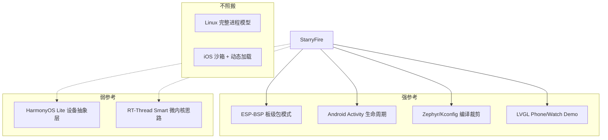
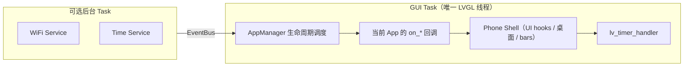
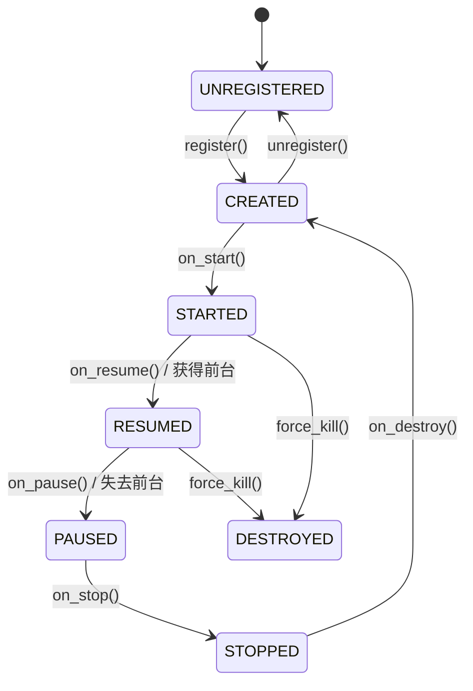
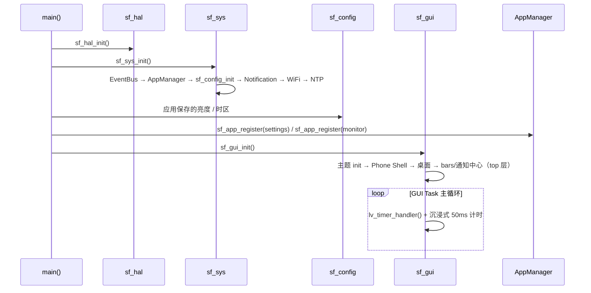

# StarryFire 设计文档

> 状态：**P0–P3 已实现**（sf_hal / sf_sys / sf_gui / 两块内置 App 均可用，构建通过）；P4 跨板验证推进中。
> 本文档为项目设计文档，标注 **【已实现】** 的章节为现状，其余为规划。具体实现以代码为准。

---

## 1. 项目概述

### 1.1 愿景

StarryFire 是一个面向 ESP32 系列芯片的**轻量级图形操作系统框架**——不是替代 FreeRTOS 的内核，而是在 ESP-IDF 之上提供：

- 统一的**板级抽象**与**编译期裁剪**
- 类桌面/手机的**应用模型**（图标、生命周期、Launcher、Intent）
- 基于 **LVGL** 的标准 GUI 运行时
- 可扩展的**第三方/自定义应用**开发方式

### 1.2 非目标（v1 不做）

| 非目标 | 原因 |
|--------|------|
| 完整 POSIX 兼容 | ESP32 资源有限，收益低 |
| 多进程 + MMU 隔离 | 多数 ESP32 无 MMU，成本高 |
| 动态链接 `.so` | Flash/RAM 开销大，工具链支持弱 |
| 替代 ESP-IDF | 复用 IDF 驱动、网络、NVS 等成熟组件 |
| v1 暗色主题 / 用户自定义主题 | ThemeEngine 预留接口，Settings 暂不暴露 |

### 1.3 目标用户场景

- 开发板 / 量产小屏设备（240×240 ~ 480×480，含圆形表盘类）
- 带触摸屏的 IoT 面板、便携仪器、教育套件
- 同一套 OS 框架，换板子只改 Kconfig / board profile，不重写业务

---

## 2. 已敲定设计决策

| # | 议题 | **决策** | 状态 |
|---|------|----------|------|
| 1 | OS 与 FreeRTOS 关系 | **单 GUI Task** 运行 LVGL 与 App 生命周期回调；仅 WiFi/传感器等耗时逻辑开独立后台 Task，且不得直接调用 LVGL | ✅ 已实现 |
| 2 | Board 配置格式 | **纯 Kconfig + `boards/<name>/sdkconfig.defaults`**，不引入 YAML 工具链 | ✅ 已实现 |
| 3 | 目标芯片范围 | **v1 仅 ESP32-S3**；HAL 接口预留扩展，C3/C6 在 P4 之后 | ✅（HAL 已抽象）|
| 4 | App 加载方式 | **v1 静态链接**，`sf_app_register()` 显式注册；SPIFFS 动态包方案暂缓 | ✅ 已实现（静态）|
| 5 | App 间跳转 | **Intent 模型**（action / extras / intent-filter 解析） | ✅ 已实现 |
| 6 | 返回 / Home 键 | **屏幕底部软导航栏**（Back / Home）+ 左边缘右滑返回手势；板级 Kconfig 映射物理按键 | ✅ 已实现（软键+手势）|
| 7 | 后台 App 策略 | 最多 **2 个 PAUSED** App，**LRU 淘汰**；带 `SF_APP_FLAG_PINNED` 的系统 App 不参与淘汰 | ✅ 已实现（`CONFIG_SF_SYS_MAX_PAUSED_APPS`）|
| 8 | UI 风格 | **编译期二选一**：`CONFIG_SF_GUI_SHELL_PHONE`（矩形）或 `CONFIG_SF_GUI_SHELL_WATCH`（圆形） | 🟡 Phone 已实现，Watch 未实现 |
| 9 | 沉浸式 | 边缘手势唤出 bars；**5s 无操作自动隐藏**；通知中心从顶部下拉呼出 | ✅ 已实现（与初版"App RESUMED 自动隐藏"方案有出入，见《手势与导航设计》）|
| 10 | 主题 | **运行时切换**（默认深色 NEBULA + 浅色 CRYSTAL 两套），持久化于配置 | ✅ 已实现 |
| 11 | 旧 LCD 驱动 | 已迁入 `sf_hal/display/backends/st7789`，条件编译挂载 | ✅ 已实现 |
| 12 | API 命名 | 统一 **`sf_` 前缀**（StarryFire） | ✅ 已实现 |
| 13 | 文档与注释 | **全部中文**（设计文档、代码注释、公开 API 说明） | ✅ 已实现 |
| 14 | IDF 版本 | **v5.4.3**（跟随 IDF LTS 策略，升级时评估 break change） | ✅ |
| 15 | 分区表 | **自定义 OTA 双分区**（3MB + 3MB）+ **SPIFFS ~10MB** 见 §7.4 | ✅ 已实现 |
| 16 | 日志体系 | **复用 ESP_LOG**，调试用 `idf.py monitor`；各层使用独立 TAG | ✅ 已实现 |
| 17 | 字体策略 | v1 直接启用内置 Montserrat 子集（12/14/16/20/28/48），**按需/懒加载 SPIFFS 字库暂缓** | ✅（内置字体）|
| 18 | 测试策略 | P0–P4 不设强制单元测试，PC 仿真框架暂缓 | ✅ 采用 |

---

## 3. 市场参考系统分析

我们从「可借鉴」和「应规避」两个维度选取参考：



| 参考系统 | 借鉴点 | 不借鉴点 |
|----------|--------|----------|
| **Android** | Activity 生命周期、Manifest 元数据、Launcher、Intent | Binder、Zygote、ART、权限框架复杂度 |
| **watchOS / Wear OS** | 单屏多 App、后台受限、表盘即系统 App | 云端同步、复杂通知体系 |
| **HarmonyOS Lite** | 硬件抽象层 HAL、设备-驱动-服务分层 | 分布式软总线 |
| **Zephyr RTOS** | Kconfig 驱动裁剪、Devicetree 板级描述 | 完整 Zephyr 内核 |
| **NuttX / RT-Thread Smart** | 用户态 App 与内核分离的思路 | 独立地址空间（ESP32 不适用） |
| **Espressif ESP-BSP** | 一板一包、`bsp_*` 统一 API | 不含应用框架 |
| **LVGL 官方 Phone Demo** | 桌面、状态栏、App 切换 UI 范式 | 无生命周期管理 |

**核心结论**：StarryFire = **ESP-IDF 底座** + **Kconfig 编译裁剪** + **Android 式生命周期 + Intent** + **ESP-BSP 式板级包**。

---

## 4. 设计原则

1. **编译期确定，运行期轻量** — 外设、Shell 形态、驱动、App 均在编译时选定。
2. **分层单向依赖（编译期 include）** — 编译期 include 方向为 APP → GUI → System → Driver，禁止反向 include。运行期允许 GUI↔System 的**回调协作**：AppManager 持有 GUI 注入的窗口接口（`sf_gui_window_ops_t`），在生命周期点反向调用 GUI 窗口管理；GUI 又回调 `sf_app_start` / `sf_app_pause_current`。二者在单 GUI Task 内协作，属依赖倒置而非依赖环（详见 §5.2）。
3. **板级与芯片解耦** — SoC 能力与板级接线分开配置（`boards/<name>/` 组件）。
4. **App 一等公民** — 系统 App 与第三方 App 共用 API 与生命周期。
5. **单线程 GUI** — 所有 LVGL 操作仅在 GUI Task 上下文执行（esp_lvgl_port 锁）。
6. **渐进式复杂度** — v1 静态 App，动态加载按需引入。

---

## 5. 总体架构

```
┌─────────────────────────────────────────────────────────────┐
│                        APP 层                                │
│  Manifest + intent-filter + sf_app_ops 生命周期回调          │
│  (settings / monitor)                                        │
├─────────────────────────┼───────────────────────────────────┤
│                      GUI 层（GUI Task）                       │
│  Phone Shell │ Launcher │ 主题 │ bars │ 通知中心 │ InputRouter│
├─────────────────────────┼───────────────────────────────────┤
│                     系统层 (System)                          │
│  AppManager │ IntentResolver │ EventBus │ Notification      │
│  WiFi │ NTP │ Config(SPIFFS)                                 │
├─────────────────────────┼───────────────────────────────────┤
│                     驱动层 (sf_hal)                          │
│  display(ST7789) │ input(CST328) │ board │ core             │
├─────────────────────────┼───────────────────────────────────┤
│                   ESP-IDF + FreeRTOS                         │

  后台 Task（可选）: WiFi 连接、SNTP 对时 … → 经 EventBus 通知，不碰 LVGL
```

### 5.1 任务模型



| 规则 | 说明 |
|------|------|
| LVGL 线程安全 | 仅 GUI Task 可调用 `lv_*` / `sf_gui_*` |
| App 生命周期 | `on_create` … `on_destroy` 在 GUI Task 中同步调用 |
| App 耗时操作 | 放独立 Task，完成后 `sf_event_publish()` 通知，App 在 `on_event` 中更新 UI |
| 栈大小 | GUI Task 栈 ≥ 8 KB（含 LVGL + 最深 App 调用链） |

### 5.2 层间通信规则

| 调用方向 | 允许 | 机制 |
|----------|------|------|
| APP → GUI | ✅ | `sf_gui_*` |
| APP → System | ✅ | `sf_sys_*`（事件、存储、网络等） |
| APP → Driver | ❌ | 必须经 System 或 HAL 服务 |
| GUI → System | ✅ | 窗口焦点、输入分发 |
| GUI ↔ System（运行期回调） | ✅ | System 经注入的 `sf_gui_window_ops_t` 反向调 GUI（ui_root 建/毁/显/隐）；GUI 调 `sf_app_start` / `sf_app_pause_current`。均发生在 GUI Task 内，无锁竞争 |
| System → Driver | ✅ | HAL 抽象 |
| Driver → 上层 | ❌ | 仅通过回调/事件上报 |

---

## 6. 各层详细设计

### 6.1 驱动层（sf_hal）

**职责**：屏蔽板级差异，向上提供统一 HAL API。

#### 6.1.1 模块划分 【已实现】

```
components/sf_hal/
├── include/                # sf_hal.h（模块接口、sf_board_pins_t、sf_display_config_t）
├── core/                   # sf_hal_core.c —— sf_hal_init() / deinit()
├── board/                  # sf_hal_board.c —— 引脚表（从板 Kconfig 收集）
├── display/
│   ├── sf_hal_display.c    # 显示驱动抽象（#if CONFIG_SF_HAL_DISPLAY_* 条件编译）
│   └── backends/
│       └── st7789/         # ST7789 驱动（已自旧 components/lcd 迁入）
└── input/
    ├── sf_hal_input.c      # 触摸驱动抽象
    └── cst328/             # CST328 I2C 触摸驱动
```

#### 6.1.2 板级配置 【已实现】

**不使用 YAML**。每块板子一个组件目录，通过根 `CMakeLists.txt` 的 `EXTRA_COMPONENT_DIRS apps boards` 注册：

```
boards/
└── esp32s3-touch-lcd-2_8/
    ├── CMakeLists.txt      # 空组件注册（idf_component_register()）
    ├── Kconfig             # 板选择 + 引脚（SF_PIN_*）+ 驱动 select
    ├── sdkconfig.defaults  # 板级硬件配置（屏幕/触摸/PSRAM/Flash/分区表）
    └── partitions.csv      # 本板专属分区表
```

**板选择机制**（根 `CMakeLists.txt`）：

1. 环境变量 `SF_BOARD=<name>` 存在 → 使用该板；
2. 否则自动探测 `boards/`：仅一个目录时自动使用，多目录时报错要求指定 `SF_BOARD`；
3. 未显式设置 `SDKCONFIG_DEFAULTS` 时，合并「根目录通用 + `boards/<board-name>/` 板级」两份 defaults（后者覆盖前者）。

**多板冲突防护**：`EXTRA_COMPONENT_DIRS boards` 会注册 boards/ 下所有板组件（Kconfig 全合并），
根 `CMakeLists.txt` 用 `EXTRA_COMPONENT_EXCLUDE_DIRS` 排除未选中的板目录（在
`include(project.cmake)` 后、`project()` 前设置），保证只有选中板的 Kconfig 参与裁剪。

```
boards/esp32s3-touch-lcd-2_8/sdkconfig.defaults:   # 仅板级差异（OS 通用项在根目录 defaults）
CONFIG_SF_BOARD_ESP32S3_TOUCH_LCD_2_8=y
CONFIG_SF_HAL_DISPLAY_ST7789=y
CONFIG_SF_HAL_DISPLAY_WIDTH=240
CONFIG_SF_HAL_DISPLAY_HEIGHT=320
CONFIG_SF_HAL_INPUT_TOUCH_CST328=y
CONFIG_SPIRAM=y
CONFIG_ESPTOOLPY_FLASHSIZE_16MB=y
CONFIG_PARTITION_TABLE_CUSTOM_FILENAME="boards/esp32s3-touch-lcd-2_8/partitions.csv"
```

引脚定义通过板 `Kconfig` 暴露为 `CONFIG_SF_PIN_*`，由 `sf_hal/board/sf_hal_board.c` 收集为 `sf_board_pins_t`。
跨板接入流程见《板级接入文档》。

#### 6.1.3 芯片范围

- v1 代码与 CI 仅保证 **ESP32-S3** 编译通过
- `sf_hal/core/Kconfig` 中 SoC 能力以 `depends on IDF_TARGET_ESP32S3`  guarding
- C3/C6 移植需重新评估 PSRAM / 帧缓冲策略

#### 6.1.4 HAL API 风格 【已实现】

驱动按编译期 `#if CONFIG_SF_HAL_*` 选择（见板 Kconfig / sdkconfig.defaults），初始化走**显式配置式 API**，
**无运行期模块表**：无参 `init(void)` 装不下 display/input 的配置参数（`sf_display_config_t` / `cst328_config_t`），
且 `board → display → input` 存在强制初始化顺序。若日后确需运行期探测/热插拔，再按真实签名引入。

```c
esp_err_t sf_hal_init(void);                              /* 统一入口（board → display → input） */
const sf_board_pins_t *sf_hal_board_get_pins(void);       /* 板级引脚表 */
esp_err_t sf_hal_display_init(const sf_display_config_t *cfg);
esp_err_t sf_hal_display_set_brightness(uint8_t percent); /* 背光 PWM */
```

---

### 6.2 系统层（sf_sys）

**职责**：OS 核心服务，App 与 HAL 之间的中介。

#### 6.2.1 核心子系统 【已实现】

| 子系统 | 职责 | 实现 |
|--------|------|------|
| **AppManager** | 注册表、生命周期、前台/后台、LRU 淘汰 | ✅ `sf_app_manager.c` |
| **IntentResolver** | 匹配 action/category，解析目标 App 与 extras | ✅ `sf_intent_resolver.c` |
| **EventBus** | 系统事件（esp_event 桥接 + 自定义事件） | ✅ `sf_event_bus.c` |
| **Notification** | 通知中心数据源（post / dismiss / 未读数） | ✅ `sf_notification.c` |
| **WiFi** | STA 连接、扫描、凭证管理（后台 Task） | ✅ `sf_wifi.c` |
| **NTP** | SNTP 对时 + 时区 | ✅ `sf_ntp.c` |
| **Config (sf_config)** | SPIFFS JSON 持久化（亮度/时区/主题/WiFi 凭证） | ✅ 独立组件 `sf_config` |
| PowerManager | 背光、休眠、冻结 PAUSED App 定时器 | ❌ 未实现（背光亮度已有） |
| StorageService | App 私有 NVS 命名空间 | ❌ 未实现 |

#### 6.2.2 App 生命周期 【已实现】

参考 Android Activity，简化为 ESP32 可实现的子集：



| 状态 | 含义 | App 应做 |
|------|------|----------|
| CREATED | 实例已分配，UI 未显示 | 初始化资源 |
| STARTED | 可见但可能无焦点 | 停止动画等 |
| RESUMED | 前台活跃 | 刷新 UI、处理输入 |
| PAUSED | 被其他 App 盖住 | 暂停耗时操作 |
| STOPPED | 不可见 | 释放非必要资源 |
| DESTROYED | 即将卸载 | 清理全部资源 |

**关键约束（v1）**：
- 同一时刻仅 **1 个 RESUMED App**
- 后台最多保留 **2 个 PAUSED App**（`CONFIG_SF_SYS_MAX_PAUSED_APPS`）
- 超出则 LRU 淘汰 → STOPPED → DESTROYED
- 生命周期节点通过 GUI 层注册的 **UI hooks**（`sf_app_manager_set_ui_hooks`）驱动 `ui_root` 的创建/显隐

> 实际注册方式为 **main() 中 `sf_app_register(&g_xxx_app_manifest)` 显式注册**，
> 与初版"链接期 .sf_app_registry 段扫描"不同。

#### 6.2.3 事件总线 【已实现】

基于 ESP-IDF `esp_event`，统一 `(base, id)` 广播：

```c
#define SF_EVENT_BASE "SF_EVENT"

typedef enum {
    SF_EVENT_BATTERY_LOW   = 0x01,
    SF_EVENT_APP_LAUNCH,
    SF_EVENT_APP_EXIT,
    SF_EVENT_BACK_PRESSED,
    SF_EVENT_HOME_PRESSED,
    SF_EVENT_SCREEN_ON,
    SF_EVENT_SCREEN_OFF,
    SF_EVENT_NOTIFICATION_POST,   /* payload = sf_notification_t* */
    SF_EVENT_APP_INTENT,          /* payload = const sf_intent_t * */
} sf_event_id_t;

esp_err_t sf_event_subscribe(esp_event_base_t base, int32_t id, sf_event_cb_t cb, void *user_data);
esp_err_t sf_event_publish(esp_event_base_t base, int32_t id, void *event_data);
void *sf_event_get_state(esp_event_base_t base, int32_t id);  /* 当前未实现，恒返回 NULL */
```

ESP-IDF 原生事件（WIFI_EVENT / IP_EVENT）自动桥接到 EventBus，App 只从此处订阅，不直接注册 IDF 事件处理器。

#### 6.2.4 Intent 模型 【已实现】

```c
#define SF_INTENT_ACTION_VIEW       "sf.intent.action.VIEW"
#define SF_INTENT_ACTION_SETTINGS   "sf.intent.action.SETTINGS"
#define SF_INTENT_ACTION_MAIN       "sf.intent.action.MAIN"
#define SF_INTENT_CATEGORY_DEFAULT  "sf.intent.category.DEFAULT"

typedef struct {
    const char *key;
    enum { SF_EXTRA_STRING, SF_EXTRA_INT } type;
    union { const char *str_val; int32_t int_val; };
} sf_intent_extra_t;

typedef struct {
    const char *action;
    const char *category;
    const char *target_app_id;      /* 显式跳转；为 NULL 时走 IntentResolver */
    const sf_intent_extra_t *extras;
    size_t extras_count;
} sf_intent_t;

esp_err_t sf_app_start_intent(const sf_intent_t *intent);
```

**Manifest intent-filter 注册**：

```c
static const sf_app_intent_filter_t s_intent_filters[] = {
    SF_APP_INTENT_FILTER(SF_INTENT_ACTION_SETTINGS, SF_INTENT_CATEGORY_DEFAULT),
};

const sf_app_manifest_t g_settings_app_manifest = {
    .id = "settings",
    .name = "Settings",
    .icon = LV_SYMBOL_SETTINGS,
    .flags = SF_APP_FLAG_SHOW_IN_LAUNCHER,
    .ops = &g_settings_app_ops,
    .intent_filters = s_intent_filters,
    .intent_filters_count = 1,
};
```

**IntentResolver 规则**：
1. 若 `target_app_id` 非空 → 直接启动该 App
2. 否则按 action + category 匹配已注册 intent-filter
3. 多个匹配 → 取第一个并打日志（v1 简化，无系统选择器）
4. 无匹配 → 返回 `ESP_ERR_NOT_FOUND`

**投递语义**：`sf_app_start_intent()` 解析出目标 App 并 `sf_app_start()` 完成后，直接调用目标 App 的 `on_event(ctx, SF_EVENT_BASE, SF_EVENT_APP_INTENT, intent)`，`extras`（如 `page=wifi`）由 App 自行读取。投递发生在调用方任务内（与 on_create 同一上下文），非广播事件总线。

#### 6.2.5 导航事件 【已实现】

| 事件 | 来源 | 行为 |
|------|------|------|
| `SF_NAV_BACK` | 左边缘右滑 / 物理键 | 先调当前 App `on_back()`；返回 `true` 已消费；否则无操作（回桌面仅由 HOME 键触发）|
| `SF_NAV_HOME` | 物理键 | `sf_app_pause_current()` + 显示桌面 |
| `SF_NAV_RECENTS` | — | 未实现（v1 无 Recents） |

物理按键映射（板 `Kconfig`）：

```ini
CONFIG_SF_PIN_BTN_BACK=6
CONFIG_SF_PIN_BTN_HOME=-1    # -1 表示未接
```

> 与初版相比：桌面由 GUI 层内嵌（非独立 App），无 Recents Overlay。

---

### 6.3 GUI 层（sf_gui）

**职责**：LVGL 之上的窗口管理、系统 UI Chrome、主题与输入路由。App **不直接**操作全屏 LVGL 根对象。

#### 6.3.1 组件 【已实现】

| 组件 | 职责 | 实现 |
|------|------|------|
| **Shell** | Phone Shell：桌面、bars、通知中心、沉浸式 | ✅ `phone/` |
| **WindowManager** | App `ui_root` 生命周期、显隐 | ✅ 内嵌于 Shell（UI hooks）|
| **ThemeEngine** | 主题调色板、预置样式、运行时切换 | ✅ `sf_theme.c` |
| **InputRouter** | 边缘手势、沉浸式计时 | ✅ `sf_gui_phone_shell.c` |
| **Launcher** | 桌面网格（遍历已注册 App） | ✅ 内嵌 GUI，非独立 App |
| DisplayServer | LVGL init、tick、flush | ✅ 复用 esp_lvgl_port |
| Toast / Fullscreen API | `sf_gui_show_toast()` / `sf_gui_request_fullscreen()` | ❌ 未实现 |

**层级约定**：桌面 + App `ui_root` 挂 `lv_scr_act()`（内容层）；状态栏/导航栏/通知中心挂
`lv_layer_top()`（系统层，天然置于 App 之上），无需手动 `move_foreground`。

#### 6.3.2 Shell 形态

| Kconfig | Shell | 状态 |
|---------|-------|------|
| `CONFIG_SF_GUI_SHELL_PHONE` | 矩形 Phone | ✅ 已实现 |
| `CONFIG_SF_GUI_SHELL_WATCH` | 圆形 Watch | ❌ 未实现 |

#### 6.3.3 沉浸式 bars 行为 【已实现】

| 场景 | bars 状态 |
|------|-----------|
| 系统启动 | 显示（开机通知） |
| 无操作 **5 秒** | 自动隐藏（immersive_idle） |
| 顶部边缘下滑 / 底部边缘上滑 | 显示 bars；bars 已显示时顶部下滑 → 呼出通知中心 |
| 任何触摸活动 | 重置 5s 计时 |
| 通知中心打开 | 保持 bars 显示，不自动隐藏 |

Phone Shell 布局（bars 显示时）：

```
┌────────────────────────────┐
│  StatusBar（顶部）           │
│                            │
│  App Content Area          │
│                            │
├────────────────────────────┤
│  ◁  ●    软导航栏            │
└────────────────────────────┘
```

#### 6.3.4 App GUI API 【已实现】

```c
lv_obj_t *sf_gui_app_get_root(struct sf_app_ctx_t *ctx);  /* App 在 on_create 中获取 UI 根 */
```

UI 根容器由 Shell 的 UI hooks 创建/销毁并赋给 `ctx->ui_root`；App 无需自行创建全屏容器。

#### 6.3.5 主题与其他 GUI 约定 【已实现】

- **两套主题运行时切换**：默认深色 `SF_THEME_NEBULA` + 浅色 `SF_THEME_AURORA`（实际命名 Crystal），
  `sf_theme_set_active()` 全局刷新，选择持久化于 sf_config。详见《主题系统设计》。
- **UI 缩放单位 `SF_UI()`**：以短边 240px 为基准按比例缩放，支持不同尺寸 LCD，见 `sf_theme.h`。
- 转场动画：未实现（v1 直接切换）。

#### 6.3.6 字体策略 【已实现：内置子集】

| 策略 | 说明 |
|------|------|
| v1 | 直接启用 LVGL 内置 Montserrat 子集：12/14/16/20/28/48（`SF_FONT_XS…XXL`）|
| Kconfig | `CONFIG_LV_FONT_MONTSERRAT_12/14/16/20/28/48=y`（`boards/<name>/sdkconfig.defaults` 板级启用，见 `SF_FONT_*_SIZE` + `sf_theme.h` token-pasting 宏）|
| SPIFFS 懒加载字库 | 暂缓（初版方案，当前无 CJK 字库需求）|

---

### 6.4 APP 层

**职责**：用户可见的功能单元，每个 App 是一个独立组件/模块。

#### 6.4.1 Manifest 【已实现】

```c
#define SF_APP_FLAG_SHOW_IN_LAUNCHER  (1 << 0)
#define SF_APP_FLAG_PINNED            (1 << 1)
#define SF_APP_FLAG_ALLOW_FULLSCREEN  (1 << 2)

const sf_app_manifest_t g_settings_app_manifest = {
    .id           = "settings",
    .name         = "Settings",
    .icon         = LV_SYMBOL_SETTINGS,      /* LVGL Symbol 字符 */
    .version      = "1.0.0",
    .flags        = SF_APP_FLAG_SHOW_IN_LAUNCHER,
    .ops          = &g_settings_app_ops,
    .intent_filters = s_intent_filters,
    .intent_filters_count = 1,
};
```

#### 6.4.2 App 入口与回调 【已实现】

```c
typedef struct {
    esp_err_t (*on_create)(sf_app_ctx_t *ctx);
    void      (*on_start)(sf_app_ctx_t *ctx);
    void      (*on_resume)(sf_app_ctx_t *ctx);
    void      (*on_pause)(sf_app_ctx_t *ctx);
    void      (*on_stop)(sf_app_ctx_t *ctx);
    void      (*on_destroy)(sf_app_ctx_t *ctx);
    bool      (*on_back)(sf_app_ctx_t *ctx);
    void      (*on_event)(sf_app_ctx_t *ctx, esp_event_base_t base, int32_t id, void *event_data);
} sf_app_ops_t;
```

#### 6.4.3 App 加载 【已实现：静态链接】

```
apps/
├── settings/                # Settings App（WiFi/蓝牙/本地化/设备信息 四页）
├── monitor/                 # Monitor App（CPU/Tasks/存储/内存 监控）
└── <custom>/
    ├── CMakeLists.txt
    ├── include/
    └── sf_app_<name>.c
```

- 通过 `EXTRA_COMPONENT_DIRS apps boards` 注册为组件
- **main() 中 `sf_app_register(&g_xxx_app_manifest)` 显式注册**（非链接期段扫描）
- 桌面在 GUI 初始化时遍历已注册 App 生成图标

#### 6.4.4 内置 App（v1）【已实现】

| App | ID | Flags | 说明 |
|-----|-----|-------|------|
| Settings | `settings` | SHOW_IN_LAUNCHER | WiFi / Bluetooth / 本地化 / 设备信息 四个子页 |
| Monitor | `monitor` | SHOW_IN_LAUNCHER | Tasks（任务 CPU 占用）/ Regions（内存分区）/ Storage（存储）三个 Tab（FreeRTOS runtime stats）|

---

## 7. 构建与目录结构

### 7.1 Kconfig 层次 【已实现】

```
StarryFire OS Configuration
├── Board Selection          （板组件 Kconfig：SF_BOARD_* + select 驱动）
├── Board Pin Configuration  （板组件 Kconfig：CONFIG_SF_PIN_*）
├── HAL Drivers              （sf_hal/Kconfig：驱动开关、屏幕参数）
├── GUI Shell                （sf_gui/Kconfig：Phone / Watch）
├── System Services          （sf_sys/Kconfig：App 槽位、LRU、事件订阅）
```

### 7.2 目标目录结构 【已实现】

```
StarryFire/
├── boards/
│   └── esp32s3-touch-lcd-2_8/    # 板级组件：CMakeLists + Kconfig + sdkconfig.defaults + partitions.csv
├── components/
│   ├── sf_hal/                   # 驱动层（display/input/board/core）
│   ├── sf_sys/                   # 系统层（AppManager/EventBus/Intent/Notification/WiFi/NTP）
│   ├── sf_config/                # 配置持久化（SPIFFS JSON）
│   └── sf_gui/
│       ├── include/  sf_theme.h / sf_gui.h / sf_gui_phone.h
│       ├── sf_theme.c
│       ├── sf_gui_shell.c
│       └── phone/                # Phone Shell：shell/launcher/bars/notification_center
├── apps/
│   ├── settings/
│   └── monitor/
├── docs/
│   ├── DESIGN.md
│   ├── 板级接入文档.md
│   ├── 主题系统设计.md
│   ├── 手势与导航设计.md
│   └── 引脚分配文档.md
├── main/
│   └── main.c
├── sdkconfig.defaults            # OS 通用配置（GUI shell/WiFi/NTP/FreeRTOS）
└── CMakeLists.txt                # SF_BOARD 探测 + SDKCONFIG_DEFAULTS 合并 + EXTRA_COMPONENT_DIRS apps boards
```

### 7.3 启动流程 【已实现】



---

### 7.4 分区表设计

**目标 Flash：16MB（ESP32-S3 N16R8 推荐）**。每块板自带独立分区表 `boards/<name>/partitions.csv`，由板级 `sdkconfig.defaults` 通过 `CONFIG_PARTITION_TABLE_CUSTOM_FILENAME="boards/<name>/partitions.csv"`（相对项目根解析）指定。

```
# StarryFire Partition Table (boards/esp32s3-touch-lcd-2_8/partitions.csv)
# Name,    Type, SubType, Offset,  Size,       Notes
nvs,       data, nvs,     0x9000,  0x4000,     # 16KB  NVS
otadata,   data, ota,     0xD000,  0x2000,     # 8KB   OTA 元数据
phy_init,  data, phy,     0xF000,  0x1000,     # 4KB   PHY 校准
ota_0,     app,  ota_0,   0x10000, 0x300000,   # 3MB   App 槽 A
ota_1,     app,  ota_1,   ,        0x300000,   # 3MB   App 槽 B
spiffs,    data, spiffs,  ,        0x9F0000,   # ~10MB 动态 App + 资源
```

**布局说明**：

| 分区 | 用量说明 |
|------|----------|
| NVS (16 KB) | ESP-IDF 标准 KV 存储，用于 WiFi 配网信息、校准数据等。StarryFire 的 WiFi 凭证等也复用此 NVS 实例 |
| OTA_0 / OTA_1 (各 3 MB) | 容纳 StarryFire 固件 + LVGL + 静态链接的内置 App。3 MB 留足二次开发空间（当前固件 ~1.4 MB，54% 空闲） |
| SPIFFS (~10 MB) | `sf_config` 配置 JSON、App 私有资源、用户数据。`.sfapp` 动态包为 P5 预留 |

**Flash 尺寸适配**：
- 换板时新建 `boards/<name>/partitions.csv`（按该板 Flash 大小裁剪），并在 `boards/<name>/sdkconfig.defaults` 中指定其路径；例如 **8MB Flash** 建议缩小 SPIFFS（`~4 MB`），OTA 槽各降为 `2 MB`：
  ```
  ota_0, app, ota_0, 0x10000, 0x200000   # 2 MB
  ota_1, app, ota_1, ,        0x200000   # 2 MB
  spiffs, data, spiffs, ,      0x3F0000  # ~4 MB
  ```
- 当前板（16MB N16R8）分区表见 `boards/esp32s3-touch-lcd-2_8/partitions.csv`

---

## 8. 资源与性能预算（ESP32-S3）

| 资源 | 预估 | 备注 |
|------|------|------|
| OS 核心 Flash | 80~120 KB | 不含 LVGL |
| LVGL + 内置字体 | 100~200 KB | Montserrat 子集 12~48 |
| LV_MEM 池 | 256 KB（PSRAM） | `CONFIG_LV_MEM_SIZE_KILOBYTES`，经 `lv_mem_psram` 路由到 PSRAM |
| Draw buffer | 10~20 KB | partial render，非全帧缓冲 |
| GUI Task 栈 | 8~12 KB | 单 Task 模型 |
| PAUSED App ×2 | 各保留 UI 对象树 | STOPPED 时必须销毁 |
| SPIFFS 分区 | ~10 MB | 配置 JSON、资源（见 §7.4） |

**策略**：
- 默认 partial render + 小 draw buffer（esp_lvgl_port）
- LVGL 堆放 PSRAM，DRAM 占用≈0
- App 进入 STOPPED 时销毁 LVGL 对象树
- 字体使用内置 Montserrat 子集（SPIFFS 懒加载暂缓）

---

## 9. 安全与稳定性

| 机制 | v1 |
|------|-----|
| 单 GUI Task（esp_lvgl_port 锁保护） | ✅ |
| 手势滚动临时禁用/恢复（`lv_obj_is_valid` 防悬空指针） | ✅ |
| 通知 banner 点击回调（user_data 所有权剥离，防 UAF） | ✅ |
| App 独立 FreeRTOS Task | ❌ |
| 权限 / 沙箱 | ❌ |
| OTA 更新 App 包 | ❌（P5 后评估） |

---

## 10. 分阶段实施路线图

| 阶段 | 目标 | 交付物 | 状态 |
|------|------|--------|------|
| **P0** | sf_hal 框架 + ST7789 迁入 + LVGL 跑通 + 首块 board profile | 可点亮的 GUI Task | ✅ 完成 |
| **P1** | AppManager + 生命周期 + EventBus + Intent | 静态 App 可切换 | ✅ 完成 |
| **P2** | Phone Shell + 软 NavBar + 沉浸式 bars + 通知中心 | Launcher 可点、桌面图标启动 App | ✅ 完成 |
| **P3** | Settings / Monitor App + Intent 跳转 + WiFi/NTP 后台 | 端到端 Demo | ✅ 完成 |
| **P4** | 第二块 S3 板 + 跨板验证 + 板级接入文档 | 跨板构建流程 | 🟡 进行中 |
| **P5** | App SDK 文档 + `.sfapp` 动态加载 + Watch Shell | 开发者生态 | ⏳ 未开始 |

---

## 11. 命名与文档规范

| 类别 | 规范 |
|------|------|
| 公开 API | `sf_<模块>_<动作>()` |
| 类型 | `sf_<name>_t` |
| 配置宏 | `CONFIG_SF_*` |
| 错误码 | 复用 `esp_err_t`，模块专用 `ESP_ERR_SF_*` |
| 代码注释 | 中文 |
| 设计文档 | 中文（本文档） |
| 日志 | 复用 `ESP_LOG`，调试用 `idf.py monitor`；组件级 TAG = `"sf_<模块>"`，App 级 = `"sf_app.<id>"` |

---

## 12. 下一步

1. **P4 跨板验证**：新增第二块 ESP32-S3 板（`boards/<name>/`），验证 `SF_BOARD=<name> idf.py build` 全流程（见《板级接入文档》）
2. 评估 P5：`.sfapp` 动态加载、Watch Shell、Recents Overlay、Toast/Fullscreen API

---

## 修订记录

| 日期 | 说明 |
|------|------|
| 2026-07-05 | 初稿：四层架构、市场参考、13 项设计决策敲定 |
| 2026-07-05 | 合并为单一 DESIGN.md |
| 2026-07-05 | 新增决策 #14–18：IDF 5.4.3 / 自定义分区表 / ESP_LOG / 按需字体 / 测试暂缓；新增 §7.4 分区表设计、§6.3.6 字体策略 |
| 2026-08-02 | **按当前实现全面更新**：P0–P3 已完成；板级机制改为 `boards/<name>/` 组件 + `SF_BOARD` 探测；EventBus 改为 esp_event 桥接；主题改为双主题运行时切换；Launcher 内嵌 GUI、App 显式注册；沉浸式 bars 行为、通知中心、SF_UI() 缩放；目录结构/启动流程/路线图刷新 |
